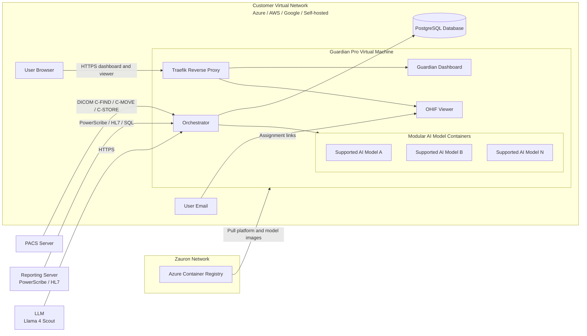

# Dedicated Installation

A dedicated installation runs Guardian Pro on a **virtual machine in your own cloud or data center**, for your organization only. Your team provisions the infrastructure, database access and connections to PACS and reporting systems. Zauron installs and operates the application on that VM.

Most organizations use [Guardian Pro SaaS](saas-onboarding.md) instead, which Zauron hosts and operates, so there is nothing for your team to install. Choose a dedicated installation when your policies require Guardian to run inside your own network.

## Choose your installation type

Select **one** type before you complete the checklist. The application stack is the same; only the host environment changes.

| Type | Where it runs | How it is provisioned |
|------|---------------|------------------------|
| **Azure** | Your Azure virtual network | Terraform module deploys into an **existing** VNet |
| **AWS** | Your AWS VPC | Terraform module deploys into an **existing** VPC |
| **Google** | Your Google Cloud VPC | Terraform module (confirm feature coverage with Zauron) |
| **Self-hosted** | Your data center or private cloud | You provision the Ubuntu VM; Zauron deploys the container stack |

Record the selected type on the installation checklist and send it to your Zauron representative.

Studies, reports and results stay in your virtual network. Guardian doesn't send DICOM studies to Zauron.

## Prerequisites

Before installing Guardian Pro, ensure you have:

- **Installation type**: Azure, AWS, Google, or Self-hosted (see above)
- **Virtual machine**: Ubuntu 22.04 LTS preferred (20.04+ accepted), with Docker 20.10+ and Docker Compose v2
- **Network**: Ability to whitelist CIDRs and configure firewall rules for DICOM, HTTPS, SQL Server, and outbound image pulls. Cloud types join an **existing** VNet/VPC; Self-hosted uses your LAN or private cloud network
- **PACS integration**: Access to your Picture Archiving and Communication System for C-FIND, C-MOVE, and/or C-STORE, plus the PACS CIDR blocks for firewall rules
- **Reporting system access**: PowerScribe (web API or SQL Server database) or an HL7 v2 report feed, plus the reporting-system CIDR blocks
- **LLM**: **Llama 4 Scout**, used to read reports. On AWS it runs in Amazon Bedrock in your account, reached through a private VPC endpoint. On Azure and Google, Zauron provides an endpoint and key for your installation
- **First administrators**: name and work email of at least one person who will administer Guardian
- **DNS and TLS**: two host names in your domain, one for Guardian and one for Zauron's operator console, with DNS records and a certificate covering both (or Let's Encrypt)
- **PostgreSQL database**: External or cloud-hosted PostgreSQL 13 or later (cloud Terraform provisions PostgreSQL 16 with private access)
- **Technical support**: IT administrator familiar with networking, DICOM, and database administration

## Installation Checklist

Download our [Installation Preparation Checklist CSV](installation-checklist.csv) to track your Guardian Pro setup progress. It can be imported into Excel, Google Sheets or any spreadsheet application.

Don't put passwords, keys or other secrets in the checklist. Zauron arranges a secure way to exchange them.

Alternatively, copy the table below into your preferred spreadsheet application.

### Installation Checklist Template

| Component | Endpoint/Host | Port | Complete (Yes/No) | Notes |
|---------|-------------|----|-----------------|-----|
| Installation type | Azure / AWS / Google / Self-hosted | N/A | No | Select one |
| VM SSH access | [VM private IP] | 22 | No | SSH key for user zauron with sudo; restrict to admin CIDRs |
| Existing VNet / VPC | [VNet, VPC, or LAN name/ID] | N/A | No | Required for Azure, AWS and Google; describe the LAN for Self-hosted |
| Guardian subnet CIDR | [unused CIDR, e.g. 10.0.100.0/24] | N/A | No | Must not overlap existing subnets |
| PACS CIDRs | [PACS subnet CIDRs] | 104 / 11112 / [site] | No | Used for firewall rules |
| Reporting CIDRs | [PowerScribe / interface engine CIDRs] | 443 / 1433 / 2575 | No | PowerScribe web API or SQL Server; HL7 feed into Guardian |
| Admin CIDRs | [office / jump-host CIDRs] | 22 | No | SSH allowlist |
| Web access CIDRs | [user network CIDRs] | 443 | No | Who may open Guardian in a browser |
| PostgreSQL database | [private DB host] | 5432 | No | Version 13+ (Terraform uses 16); database guardian_pro; SSL; credentials exchanged securely |
| Guardian DICOM SCP | [VM IP] | 4000 | No | AE title GUARDIAN_SCP |
| Guardian web address and console address | [guardian.yourdomain] and [console.guardian.yourdomain] | 443 | No | DNS records to the VM; certificate covering both, or Let's Encrypt |
| PACS (remote SCP) | [PACS host] | [PACS port] | No | Remote AE title (site-specific) |
| Reporting system | [PowerScribe host or interface engine] | 443 / 1433 / 2575 | No | Service account password exchanged securely |
| First administrators | [names and work emails] | N/A | No | At least one |
| Sign-in method | [SSO issuer / LDAP server / email links] | N/A | No | Secrets exchanged securely |
| Outbound: Zauron container registry | zauron.azurecr.io | 443 | No | Registry credentials issued by Zauron for this installation |
| Outbound: LLM endpoint | [Bedrock VPC endpoint on AWS; provided by Zauron on Azure and Google] | 443 | No | Llama 4 Scout |

### CSV Format (Copy & Paste)

For easy import into spreadsheet applications, copy this CSV data:

```
Component,Endpoint/Host,Port,Complete (Yes/No),Notes
Installation type,Azure / AWS / Google / Self-hosted,N/A,No,Select one
VM SSH access,[VM private IP],22,No,SSH key for user zauron with sudo; restrict to admin CIDRs
Existing VNet / VPC,"[VNet, VPC, or LAN name/ID]",N/A,No,"Required for Azure, AWS and Google; describe the LAN for Self-hosted"
Guardian subnet CIDR,"[unused CIDR, e.g. 10.0.100.0/24]",N/A,No,Must not overlap existing subnets
PACS CIDRs,[PACS subnet CIDRs],104 / 11112 / [site],No,Used for firewall rules
Reporting CIDRs,[PowerScribe / interface engine CIDRs],443 / 1433 / 2575,No,PowerScribe web API or SQL Server; HL7 feed into Guardian
Admin CIDRs,[office / jump-host CIDRs],22,No,SSH allowlist
Web access CIDRs,[user network CIDRs],443,No,Who may open Guardian in a browser
PostgreSQL database,[private DB host],5432,No,Version 13+ (Terraform uses 16); database guardian_pro; SSL; credentials exchanged securely
Guardian DICOM SCP,[VM IP],4000,No,AE title GUARDIAN_SCP
Guardian web address and console address,[guardian.yourdomain] and [console.guardian.yourdomain],443,No,"DNS records to the VM; certificate covering both, or Let's Encrypt"
PACS (remote SCP),[PACS host],[PACS port],No,Remote AE title (site-specific)
Reporting system,[PowerScribe host or interface engine],443 / 1433 / 2575,No,Service account password exchanged securely
First administrators,[names and work emails],N/A,No,At least one
Sign-in method,[SSO issuer / LDAP server / email links],N/A,No,Secrets exchanged securely
Outbound: Zauron container registry,zauron.azurecr.io,443,No,Registry credentials issued by Zauron for this installation
Outbound: LLM endpoint,[Bedrock VPC endpoint on AWS; provided by Zauron on Azure and Google],443,No,Llama 4 Scout
```

**Instructions:**
1. Copy the table above into Excel, Google Sheets, or your preferred spreadsheet application
2. Select **Azure**, **AWS**, **Google**, or **Self-hosted** in the Installation type row
3. Replace bracketed placeholders (e.g., `[VM IP]`) with your actual configuration values
4. Mark "Complete" column as Yes/No as you provision each component
5. Use the Notes column for any additional configuration details or issues
6. Send the completed checklist to your Zauron representative before installation

## Common infrastructure requirements

These apply to every installation type.

### Virtual Machine
- **Operating system**: Ubuntu 22.04 LTS preferred (20.04 LTS or later accepted)
- **Compute**: 4 vCPU / 16 GB RAM minimum (cloud Terraform default: Azure `Standard_D4s_v3` or AWS `m5.xlarge`). **12 vCPU / 32 GB RAM** is recommended for production
- **Storage**: 64 GB OS disk plus a dedicated data disk (typical **512 GB**) mounted at `/opt/guardian-data` for cache, DICOMweb, precache, and logs
- **SSH access**: SSH key for user **`zauron`** with sudo privileges
- **Runtime**: Docker 20.10 or later and Docker Compose v2

### Database Requirements
- **PostgreSQL**: Version 13 or later. Cloud Terraform modules provision **PostgreSQL 16**
- **Database name**: `guardian_pro` (typical)
- **Network access**: Private only from the Guardian VM
- **TLS**: `sslmode=require`
- **Extensions**: `uuid-ossp` and `pgcrypto`
- **Backups**: 14-day retention in the Terraform modules (geo-redundant / Multi-AZ in production)
- Credentials may be stored as a local secret or referenced from a cloud secret store during Zauron configuration

### LLM Endpoint Requirements
- **Model**: **Llama 4 Scout**
- **AWS**: Amazon Bedrock in your account, through a private VPC endpoint that the Terraform module creates. Guardian uses the VM's instance role, so there is no key.
- **Azure and Google**: an endpoint and key issued for your installation only, so it can be rotated or revoked on its own
- **Network**: The Guardian VM must reach the endpoint over HTTPS (private endpoint preferred)

### Network and Security Requirements

**Inbound (to the Guardian VM):**

| Port | Service | Typical source |
|------|---------|----------------|
| `22` | SSH (`zauron`) | Admin CIDRs |
| `80` / `443` | Traefik reverse proxy (dashboard, OHIF viewer, DICOMweb) | Users on the virtual network |
| `4000` | Guardian DICOM SCP (`GUARDIAN_SCP`) for inbound C-STORE | PACS CIDRs |
| `8090` | Status dashboard on the host (also published at `/` on 443) | Virtual network |
| `2575` | HL7 v2 report feed (MLLP), when used | Interface engine |

**Outbound (from the Guardian VM):**

| Destination | Ports | Purpose |
|-------------|-------|---------|
| Customer PACS | Site DICOM ports (commonly `104` and `11112`); Guardian SCU source pool typically `11200`–`12000` | C-FIND / C-MOVE (`GUARDIAN_SCU`) |
| PowerScribe | `443` (web API) or SQL Server `1433` | Report ingestion |
| `zauron.azurecr.io` | `443` | Pull Guardian platform images and supported AI model containers |
| LLM endpoint | `443` | Report reading (Bedrock VPC endpoint on AWS) |
| Email service | `443` / `587` | Assignment emails |
| PostgreSQL | `5432` | Application database (private) |

- **TLS**: Let's Encrypt, a customer-provided certificate, or self-signed (lab only)

## Azure

Use this type when Guardian runs in **your Azure VNet**.

Provide before install:

| Item | What to give Zauron |
|------|---------------------|
| Existing network | VNet name and resource group |
| Compute placement | Unused CIDR for a new Guardian subnet (example `10.0.100.0/24`) |
| Database placement | Room for a second subnet in the same VNet (PostgreSQL Flexible Server private access) |
| PACS / reporting / admin CIDRs | Allowlists for DICOM, reporting, and SSH |
| LLM | Zauron provides the Llama 4 Scout endpoint and key for your installation |

The Azure Terraform module deploys the VM, private PostgreSQL, disks, and NSG into the existing VNet. A public IP is created only when admin CIDRs are set. Cloud identity uses a system-assigned managed identity.

## AWS

Use this type when Guardian runs in **your AWS VPC**.

Provide before install:

| Item | What to give Zauron |
|------|---------------------|
| Existing network | VPC ID |
| Compute placement | Existing subnet ID for the VM |
| Database placement | Two or more subnet IDs in different AZs for RDS |
| PACS / reporting / admin CIDRs | Allowlists for DICOM, reporting, and SSH |
| LLM | Nothing to provide: Terraform enables Amazon Bedrock (Llama 4 Scout) in your account behind a VPC endpoint |

The AWS Terraform module deploys the EC2 instance and private RDS into the existing VPC. Public IP is optional. Cloud identity uses an instance profile (SSM supported).

## Google

Use this type when Guardian runs in **your Google Cloud VPC**.

A Guardian Terraform module for Google Cloud deploys the VM, disk, private PostgreSQL and firewall rules. Confirm with Zauron which features are available on Google before you start.

Provide before install:

| Item | What to give Zauron |
|------|---------------------|
| Existing network | VPC name and subnet |
| Compute placement | VM subnet with unused address space |
| Database placement | Private Cloud SQL (PostgreSQL) reachable from the VM |
| PACS / reporting / admin CIDRs | Firewall allowlists |
| LLM | Zauron provides the Llama 4 Scout endpoint and key for your installation |

## Self-hosted

Use this type when Guardian runs in **your data center or private cloud** (not Azure, AWS, or Google as the VM host).

You provision the Ubuntu VM and PostgreSQL. Zauron deploys the same container stack over SSH as `zauron`.

Provide before install:

| Item | What to give Zauron |
|------|---------------------|
| VM | Ubuntu host with the compute and disk sizes above |
| Network | LAN/VLAN description and firewall rules matching the inbound/outbound tables |
| PACS / reporting / admin CIDRs | Allowlists for DICOM, reporting, and SSH |
| LLM | Zauron provides the Llama 4 Scout endpoint and key for your installation (reachable from the VM) |

## Network Diagram

The diagram below shows a typical installation: PACS and reporting systems are reached from the customer virtual network; users open the dashboard and assignment emails on that network; application and AI model images are pulled from Zauron's container registry.



Users interface with Guardian Pro in two ways:

1. **Dashboard** in the browser (`https://<your-domain>/`)
2. **Assignments** via email, which open the OHIF viewer (`https://<your-domain>/viewer/`)

## Installation Steps

These steps apply after you have selected Azure, AWS, Google, or Self-hosted.

#### 1. Provision the virtual machine

**VM specifications:**
- Ubuntu 22.04 LTS preferred (20.04 LTS or later accepted)
- 4 vCPU / 16 GB RAM minimum; 12 vCPU / 32 GB RAM recommended for production
- 64 GB OS disk plus a dedicated data disk (512 GB typical) mounted at `/opt/guardian-data`
- SSH key access for user **`zauron`** with sudo
- Docker and Docker Compose v2 installed
- Azure and AWS: use the Guardian Terraform module so the VM joins the existing VNet/VPC

```bash
# Example AWS EC2 instance creation (c5.4xlarge ≈ 16 vCPU, 32 GB RAM)
# Prefer the Guardian Terraform module for Azure and AWS installs
aws ec2 run-instances \
  --image-id ami-0abcdef1234567890 \
  --count 1 \
  --instance-type c5.4xlarge \
  --key-name zauron-ssh-key \
  --security-group-ids sg-12345678 \
  --subnet-id subnet-12345678 \
  --user-data '#!/bin/bash
    useradd -m -s /bin/bash zauron
    usermod -aG sudo zauron
    mkdir -p /home/zauron/.ssh
    echo "ssh-rsa YOUR_PUBLIC_KEY_HERE" >> /home/zauron/.ssh/authorized_keys
    chown -R zauron:zauron /home/zauron/.ssh
    chmod 600 /home/zauron/.ssh/authorized_keys
  '
```

Create host data directories (Zauron will bind-mount these into the containers):

```bash
sudo mkdir -p /opt/guardian-data/{cache,dicomweb,precache,logs}
sudo chown -R zauron:zauron /opt/guardian-data
```

#### 2. Configure database access

1. Ensure PostgreSQL 13+ is running (cloud Terraform provisions 16) and reachable **privately** from the VM
2. Create a database user with read/write permissions on `guardian_pro`
3. Enable SSL and the `uuid-ossp` and `pgcrypto` extensions
4. Record the host, port and database name on the installation checklist, and give Zauron the credentials over a secure channel

Zauron initializes schema and runs migrations on first deploy.

#### 3. Configure PACS integration

Whitelist Guardian as a DICOM node:

| Setting | Typical value |
|---------|----------------|
| IP address | Guardian VM IP |
| AE Title (inbound SCP) | `GUARDIAN_SCP` |
| Port | `4000` |
| AE Title (outbound SCU) | `GUARDIAN_SCU` |

**Configuration steps:**
1. Access your PACS administration console
2. Add a remote DICOM node with the SCP values above (for C-STORE push into Guardian)
3. Allow Guardian's SCU (`GUARDIAN_SCU`) to C-FIND and C-MOVE studies to `GUARDIAN_SCP`
4. Test connectivity with a DICOM echo (C-ECHO)

#### 4. Configure reporting system integration

Guardian ingests finalized reports using one or more of these clients:

| Client | Use when |
|--------|----------|
| PowerScribe web API | Primary PowerScribe integration |
| HL7 v2 (ORU^R01) | Your interface engine sends finalized reports to Guardian over MLLP. See the [HL7 Report Interface](integrations/hl7.md). |
| PowerScribe database (SQL Server) | Read-only access to the PowerScribe database |

Allow the Guardian VM IP on the reporting host. Give your Zauron representative the endpoint URL and a service account (password over a secure channel). For HL7, share the [HL7 Report Interface](integrations/hl7.md) with your interface team.

#### 5. Allow outbound access to Zauron's container registry and the LLM

The VM must pull images from Zauron's container registry (`zauron.azurecr.io`): the Guardian application and the AI models you license. Zauron issues registry credentials for your installation only.

The VM must also reach the LLM endpoint over HTTPS.

#### 6. Zauron deploys the Guardian Pro container stack

After the checklist is complete, Zauron configures the site environment file and starts the stack with Docker Compose:

- **Guardian application**: report ingestion, PACS connections, AI processing and the dashboard
- **Reverse proxy**: TLS on ports 80/443
- **Viewer**: the OHIF viewer and peer-review assignments
- **DataForge**: imaging annotation and model validation (see [DataForge](dataforge/overview.md))

You do not install Guardian Pro from a public download. First-time database init, migrations, and config seeding are handled by Zauron on deploy.

#### 7. Sign-in and users

Guardian has no shared passwords. Your first administrators sign in with a one-time link sent to their work email, or through single sign-on (OIDC) or LDAP once your directory is connected. They add everyone else in the dashboard **Admin** tab. With a directory, users and roles can come from your directory groups. See [Sign-in and users](saas-onboarding.md#sign-in-and-users); the options are the same for dedicated installations.

### Post-Installation Verification

1. **Health check**: `https://<your-domain>/health` or `http://<vm>:8090/health`
2. **Dashboard**: Open `https://<your-domain>/` in a browser on your network
3. **DICOM**: Confirm C-ECHO and a test study retrieval from PACS
4. **Email**: Confirm radiologists receive assignment messages with viewer links
5. **Reporting**: Confirm finalized reports appear in Guardian after a test exam
6. **LLM**: Confirm reports are being read (the LLM endpoint is reachable from the VM)

## Common Configuration Issues

### DICOM Connectivity Problems
- **Symptom**: Studies not appearing in Guardian Pro
- **Solution**: Verify AE titles (`GUARDIAN_SCP` / `GUARDIAN_SCU`), port `4000`, C-MOVE destination, and firewall rules (including SCU source ports `11200`–`12000`)
- **Debug**: Use DICOM verification tools such as `dcmtk` or `pynetdicom`

### Image Pull Failures
- **Symptom**: Model or platform containers fail to start
- **Solution**: Confirm outbound HTTPS to `zauron.azurecr.io` and that Zauron registry credentials are valid
- **Debug**: From the VM, test `docker login zauron.azurecr.io`

### LLM Endpoint Problems
- **Symptom**: Report structuring does not run, or LLM worker errors in logs
- **Solution**: Confirm outbound HTTPS to the LLM endpoint (on AWS, the Bedrock VPC endpoint and the VM's instance role)
- **Debug**: From the VM, test HTTPS to the LLM endpoint

### Email Delivery Problems
- **Symptom**: Radiologists not receiving review notifications
- **Solution**: Check spam filters and allowed sender addresses
- **Debug**: Send a test assignment from the dashboard and review mail logs

## Security Considerations

### Data Protection
- DICOM private tags are removed from the copies Guardian keeps, using keys unique to your installation
- Peer-review links are time-limited
- Dashboard and viewer traffic uses TLS

### Network Security
- Open only the inbound ports listed above
- Treat the VM as a trust boundary: it holds Docker access for model containers and connections to PACS and reporting
- Every user signs in as themselves (email sign-in link, SSO or LDAP). There is no shared administrator password. Radiologists open assigned cases from time-limited email links.

## Support and Maintenance

### Ongoing Support
- **24/7 Monitoring**: Zauron team monitors system health
- **Technical Support**: Dedicated support team for configuration issues
- **Updates**: Your installation pulls tested Guardian releases and licensed model images from Zauron's container registry. Zauron never pushes changes into your environment.

### Maintenance Windows
- **Scheduled Maintenance**: Monthly maintenance windows (typically weekends)
- **Emergency Updates**: Critical security patches applied as needed
- **Backup Procedures**: Automated database backups with disaster recovery testing

## Getting Help

If you encounter issues during installation:

1. **Documentation**: Check this guide and the [API Reference](api_reference.md)
2. **Email**: [service@zauronlabs.com](mailto:service@zauronlabs.com)
3. **Professional Services**: Engage Zauron's implementation team for complex deployments

## Next Steps

After successful installation:

1. **User Training**: Conduct brief training sessions for radiologists (see [Training & Onboarding](training.md))
2. **Process Documentation**: Update your internal procedures
3. **Compliance Monitoring**: Begin tracking peer review compliance metrics on the dashboard
4. **Configuration**: Confirm picker and employer policies from the [Options](options.md) worksheet

Contact your Zauron representative to schedule post-installation optimization and training sessions.
