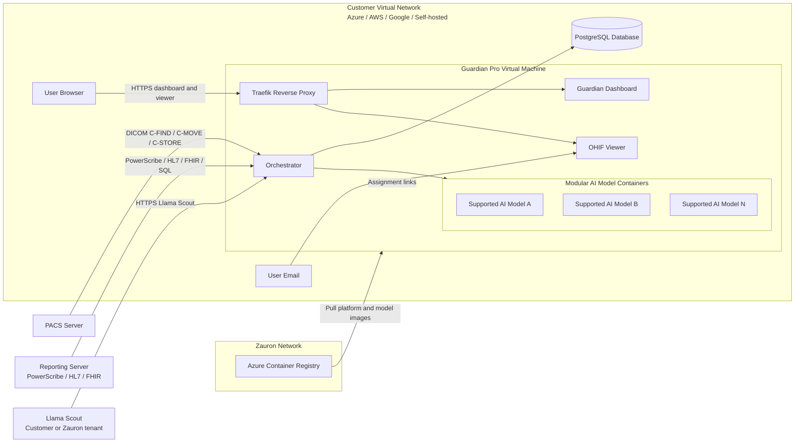

# Installation Guide

Guardian Pro is deployed as a **customer-hosted virtual machine** inside your on-premises or cloud virtual network. Zauron installs and operates the container stack on that VM after your team provisions infrastructure, database access, and connections to PACS and reporting systems.

## Choose your installation type

Select **one** type before you complete the checklist. The application stack is the same; only the host environment changes.

| Type | Where it runs | How it is provisioned |
|------|---------------|------------------------|
| **Azure** | Your Azure virtual network | Terraform module deploys into an **existing** VNet |
| **AWS** | Your AWS VPC | Terraform module deploys into an **existing** VPC |
| **Google** | Your Google Cloud VPC | You provision equivalent networking and a VM (no Terraform module yet) |
| **Self-hosted** | Your data center or private cloud | You provision the Ubuntu VM; Zauron deploys the container stack |

Record the selected type on the installation checklist and send it to your Zauron representative.

Zauron does not require you to forward DICOM studies to a Zauron-hosted cloud. Studies stay in your virtual network after anonymization on the Guardian VM.

## Prerequisites

Before installing Guardian Pro, ensure you have:

- **Installation type**: Azure, AWS, Google, or Self-hosted (see above)
- **Virtual machine**: Ubuntu 22.04 LTS preferred (20.04+ accepted), with Docker 20.10+ and Docker Compose v2
- **Network**: Ability to whitelist CIDRs and configure firewall rules for DICOM, HTTPS, SQL Server, and outbound image pulls. Cloud types join an **existing** VNet/VPC; Self-hosted uses your LAN or private cloud network
- **PACS integration**: Access to your Picture Archiving and Communication System for C-FIND, C-MOVE, and/or C-STORE, plus the PACS CIDR blocks for firewall rules
- **Reporting system access**: PowerScribe (SOAP WebAPI or SQL Server), HL7, and/or Epic FHIR, plus the reporting-system CIDR blocks
- **LLM endpoint**: **Llama Scout** (default) in the **customer tenant** or a **Zauron tenant**. The Guardian VM needs outbound HTTPS to that endpoint
- **Radiologist list**: Current roster of radiologists for enrollment
- **PostgreSQL database**: External or cloud-hosted PostgreSQL 13 or later (cloud Terraform provisions PostgreSQL 16 with private access)
- **Technical support**: IT administrator familiar with networking, DICOM, and database administration

## Installation Checklist

Download our [Installation Preparation Checklist CSV](installation-checklist.csv) to track your Guardian Pro setup progress. This CSV file includes placeholders for all required configuration details and can be imported into Excel, Google Sheets, or any spreadsheet application.

Alternatively, copy the table below into your preferred spreadsheet application.

### Installation Checklist Template

| Component | Username | Password | Endpoint/Host | Port | Complete (Yes/No) | Notes |
|-----------|----------|----------|---------------|------|-------------------|-------|
| Installation type | N/A | N/A | Azure / AWS / Google / Self-hosted | N/A | No | Select one |
| VM SSH Access | zauron | N/A | [VM private IP] | 22 | No | SSH key; user `zauron` with sudo; restrict to admin CIDRs |
| Existing VNet / VPC | N/A | N/A | [VNet, VPC, or LAN name/ID] | N/A | No | Required for Azure, AWS, and Google; describe LAN for Self-hosted |
| Guardian subnet CIDR | N/A | N/A | [unused CIDR, e.g. 10.0.100.0/24] | N/A | No | Must not overlap existing subnets |
| PACS CIDRs | N/A | N/A | [PACS subnet CIDRs] | 104 / 11112 / [site] | No | Used for NSG / security-group rules |
| Reporting CIDRs | N/A | N/A | [PowerScribe / HL7 / FHIR CIDRs] | 443 / 1433 / [MLLP] | No | HTTPS, SQL Server, and optional HL7 |
| Admin CIDRs | N/A | N/A | [office / jump-host CIDRs] | 22 | No | SSH allowlist |
| PostgreSQL Database | [db_username] | [db_password] | [private DB host] | 5432 | No | Version 13+ (Terraform uses 16); database name `guardian_pro`; SSL |
| Guardian DICOM SCP | N/A | N/A | [VM IP] | 4000 | No | AE Title `GUARDIAN_SCP` |
| Guardian Dashboard | N/A | N/A | [VM IP or domain] | 443 / 8090 | No | HTTPS via Traefik; dashboard also on 8090 |
| Guardian Viewer | N/A | N/A | [VM IP or domain] | 80 / 443 | No | HTTPS required |
| PACS (remote SCP) | N/A | N/A | [PACS host] | [PACS port] | No | Remote AE Title (site-specific) |
| Reporting system | [username] | [password] | [PowerScribe / HL7 / FHIR host] | 443 / [MLLP] | No | PowerScribe API, HL7, SQL Server, or Epic FHIR |
| LLM endpoint (Llama Scout) | [provided] | [provided] | [Llama Scout endpoint] | 443 | No | Customer tenant or Zauron tenant |
| Zauron Azure Container Registry | [provided by Zauron] | [provided by Zauron] | zauron.azurecr.io | 443 | No | Outbound pull of platform and model images |

### CSV Format (Copy & Paste)

For easy import into spreadsheet applications, copy this CSV data:

```
Component,Username,Password,Endpoint/Host,Port,Complete (Yes/No),Notes
Installation type,N/A,N/A,Azure / AWS / Google / Self-hosted,N/A,No,Select one
VM SSH Access,zauron,N/A,[VM private IP],22,No,SSH key; user zauron with sudo; restrict to admin CIDRs
Existing VNet / VPC,N/A,N/A,[VNet VPC or LAN name/ID],N/A,No,Required for Azure AWS and Google; describe LAN for Self-hosted
Guardian subnet CIDR,N/A,N/A,[unused CIDR e.g. 10.0.100.0/24],N/A,No,Must not overlap existing subnets
PACS CIDRs,N/A,N/A,[PACS subnet CIDRs],104 / 11112 / [site],No,Used for NSG / security-group rules
Reporting CIDRs,N/A,N/A,[PowerScribe / HL7 / FHIR CIDRs],443 / 1433 / [MLLP],No,HTTPS SQL Server and optional HL7
Admin CIDRs,N/A,N/A,[office / jump-host CIDRs],22,No,SSH allowlist
PostgreSQL Database,[db_username],[db_password],[private DB host],5432,No,Version 13+ (Terraform uses 16); database name guardian_pro; SSL
Guardian DICOM SCP,N/A,N/A,[VM IP],4000,No,AE Title GUARDIAN_SCP
Guardian Dashboard,N/A,N/A,[VM IP or domain],443 / 8090,No,HTTPS via Traefik; dashboard also on 8090
Guardian Viewer,N/A,N/A,[VM IP or domain],80 / 443,No,HTTPS required
PACS (remote SCP),N/A,N/A,[PACS host],[PACS port],No,Remote AE Title (site-specific)
Reporting system,[username],[password],[PowerScribe / HL7 / FHIR host],443 / [MLLP],No,PowerScribe API HL7 SQL Server or Epic FHIR
LLM endpoint (Llama Scout),[provided],[provided],[Llama Scout endpoint],443,No,Customer tenant or Zauron tenant
Zauron Azure Container Registry,[provided by Zauron],[provided by Zauron],zauron.azurecr.io,443,No,Outbound pull of platform and model images
```

**Instructions:**
1. Copy the table above into Excel, Google Sheets, or your preferred spreadsheet application
2. Select **Azure**, **AWS**, **Google**, or **Self-hosted** in the Installation type row
3. Replace bracketed placeholders (e.g., `[VM IP]`) with your actual configuration values
4. Mark "Complete" column as Yes/No as you provision each component
5. Use the Notes column for any additional configuration details or issues
6. Send the completed checklist to your Zauron representative before installation

## Common infrastructure requirements

These apply to every installation type.

### Virtual Machine
- **Operating system**: Ubuntu 22.04 LTS preferred (20.04 LTS or later accepted)
- **Compute**: 4 vCPU / 16 GB RAM minimum (cloud Terraform default: Azure `Standard_D4s_v3` or AWS `m5.xlarge`). **12 vCPU / 32 GB RAM** is recommended for production
- **Storage**: 64 GB OS disk plus a dedicated data disk (typical **512 GB**) mounted at `/opt/guardian-data` for cache, DICOMweb, precache, and logs
- **SSH access**: SSH key for user **`zauron`** with sudo privileges
- **Runtime**: Docker 20.10 or later and Docker Compose v2

### Database Requirements
- **PostgreSQL**: Version 13 or later. Cloud Terraform modules provision **PostgreSQL 16**
- **Database name**: `guardian_pro` (typical)
- **Network access**: Private only from the Guardian VM
- **TLS**: `sslmode=require`
- **Extensions**: `uuid-ossp` and `pgcrypto`
- **Backups**: 14-day retention in the Terraform modules (geo-redundant / Multi-AZ in production)
- Credentials may be stored as a local secret or referenced from a cloud secret store during Zauron configuration

### LLM Endpoint Requirements
- **Default model**: **Llama Scout** (`llama-scout`)
- **Tenant**: The **customer's** tenant or a **Zauron** tenant (AWS, Azure, or Google)
- **Network**: The Guardian VM must reach the Llama Scout endpoint over HTTPS (private endpoint or peering preferred)
- **Credentials**: API key or IAM/managed identity, provided to Zauron during configuration

### Network and Security Requirements

**Inbound (to the Guardian VM):**

| Port | Service | Typical source |
|------|---------|----------------|
| `22` | SSH (`zauron`) | Admin CIDRs |
| `80` / `443` | Traefik reverse proxy (dashboard, OHIF viewer, DICOMweb) | Users on the virtual network |
| `4000` | Guardian DICOM SCP (`GUARDIAN_SCP`) for inbound C-STORE | PACS CIDRs |
| `8090` | Status dashboard on the host (also published at `/` on 443) | Virtual network |

**Outbound (from the Guardian VM):**

| Destination | Ports | Purpose |
|-------------|-------|---------|
| Customer PACS | Site DICOM ports (commonly `104` and `11112`); Guardian SCU source pool typically `11200`–`12000` | C-FIND / C-MOVE (`GUARDIAN_SCU`) |
| PowerScribe / FHIR / HL7 | `443`, SQL Server `1433`, and site MLLP for HL7 v2 | Report ingestion |
| `zauron.azurecr.io` | `443` | Pull Guardian platform images and supported AI model containers |
| Llama Scout | `443` | Report structuring (LLM); customer or Zauron tenant |
| SMTP or Azure Communication Services | `443` / `587` | Assignment emails |
| PostgreSQL | `5432` | Application database (private) |

- **TLS**: Let's Encrypt, a customer-provided certificate, or self-signed (lab only)

## Azure

Use this type when Guardian runs in **your Azure VNet**.

Provide before install:

| Item | What to give Zauron |
|------|---------------------|
| Existing network | VNet name and resource group |
| Compute placement | Unused CIDR for a new Guardian subnet (example `10.0.100.0/24`) |
| Database placement | Room for a second subnet in the same VNet (PostgreSQL Flexible Server private access) |
| PACS / reporting / admin CIDRs | Allowlists for DICOM, reporting, and SSH |
| Llama Scout | Endpoint in the customer Azure tenant or the Zauron tenant |

The Azure Terraform module deploys the VM, private PostgreSQL, disks, and NSG into the existing VNet. A public IP is created only when admin CIDRs are set. Cloud identity uses a system-assigned managed identity.

## AWS

Use this type when Guardian runs in **your AWS VPC**.

Provide before install:

| Item | What to give Zauron |
|------|---------------------|
| Existing network | VPC ID |
| Compute placement | Existing subnet ID for the VM |
| Database placement | Two or more subnet IDs in different AZs for RDS |
| PACS / reporting / admin CIDRs | Allowlists for DICOM, reporting, and SSH |
| Llama Scout | Endpoint in the customer AWS tenant or the Zauron tenant |

The AWS Terraform module deploys the EC2 instance and private RDS into the existing VPC. Public IP is optional. Cloud identity uses an instance profile (SSM supported).

## Google

Use this type when Guardian runs in **your Google Cloud VPC**.

There is no Guardian Terraform module for GCP yet. Provision the equivalent of the common VM, disk, private PostgreSQL, and firewall rules yourself (or with your own Terraform), then Zauron deploys the container stack.

Provide before install:

| Item | What to give Zauron |
|------|---------------------|
| Existing network | VPC name and subnet |
| Compute placement | VM subnet with unused address space |
| Database placement | Private Cloud SQL (PostgreSQL) reachable from the VM |
| PACS / reporting / admin CIDRs | Firewall allowlists |
| Llama Scout | Endpoint in the customer Google tenant or the Zauron tenant |

## Self-hosted

Use this type when Guardian runs in **your data center or private cloud** (not Azure, AWS, or Google as the VM host).

You provision the Ubuntu VM and PostgreSQL. Zauron deploys the same container stack over SSH as `zauron`.

Provide before install:

| Item | What to give Zauron |
|------|---------------------|
| VM | Ubuntu host with the compute and disk sizes above |
| Network | LAN/VLAN description and firewall rules matching the inbound/outbound tables |
| PACS / reporting / admin CIDRs | Allowlists for DICOM, reporting, and SSH |
| Llama Scout | Endpoint in the customer tenant or the Zauron tenant (reachable from the VM) |

## Network Diagram

The diagram below shows a typical installation: PACS and reporting systems are reached from the customer virtual network; users open the dashboard and assignment emails on that network; AI model images are pulled from Azure Container Registry on the Zauron network. Llama Scout may live in the customer tenant or the Zauron tenant.



Users interface with Guardian Pro in two ways:

1. **Dashboard** in the browser (`https://<your-domain>/`)
2. **Assignments** via email, which open the OHIF viewer (`https://<your-domain>/viewer/`)

## Installation Steps

These steps apply after you have selected Azure, AWS, Google, or Self-hosted.

#### 1. Provision the virtual machine

**VM specifications:**
- Ubuntu 22.04 LTS preferred (20.04 LTS or later accepted)
- 4 vCPU / 16 GB RAM minimum; 12 vCPU / 32 GB RAM recommended for production
- 64 GB OS disk plus a dedicated data disk (512 GB typical) mounted at `/opt/guardian-data`
- SSH key access for user **`zauron`** with sudo
- Docker and Docker Compose v2 installed
- Azure and AWS: use the Guardian Terraform module so the VM joins the existing VNet/VPC

```bash
# Example AWS EC2 instance creation (c5.4xlarge ≈ 16 vCPU, 32 GB RAM)
# Prefer the Guardian Terraform module for Azure and AWS installs
aws ec2 run-instances \
  --image-id ami-0abcdef1234567890 \
  --count 1 \
  --instance-type c5.4xlarge \
  --key-name zauron-ssh-key \
  --security-group-ids sg-12345678 \
  --subnet-id subnet-12345678 \
  --user-data '#!/bin/bash
    useradd -m -s /bin/bash zauron
    usermod -aG sudo zauron
    mkdir -p /home/zauron/.ssh
    echo "ssh-rsa YOUR_PUBLIC_KEY_HERE" >> /home/zauron/.ssh/authorized_keys
    chown -R zauron:zauron /home/zauron/.ssh
    chmod 600 /home/zauron/.ssh/authorized_keys
  '
```

Create host data directories (Zauron will bind-mount these into the containers):

```bash
sudo mkdir -p /opt/guardian-data/{cache,dicomweb,precache,logs}
sudo chown -R zauron:zauron /opt/guardian-data
```

#### 2. Configure database access

1. Ensure PostgreSQL 13+ is running (cloud Terraform provisions 16) and reachable **privately** from the VM
2. Create a database user with read/write permissions on `guardian_pro`
3. Enable SSL and the `uuid-ossp` and `pgcrypto` extensions
4. Record host, port, database name, username, and password on the installation checklist

Zauron initializes schema and runs migrations on first deploy.

#### 3. Configure PACS integration

Whitelist Guardian as a DICOM node:

| Setting | Typical value |
|---------|----------------|
| IP address | Guardian VM IP |
| AE Title (inbound SCP) | `GUARDIAN_SCP` |
| Port | `4000` |
| AE Title (outbound SCU) | `GUARDIAN_SCU` |

**Configuration steps:**
1. Access your PACS administration console
2. Add a remote DICOM node with the SCP values above (for C-STORE push into Guardian)
3. Allow Guardian's SCU (`GUARDIAN_SCU`) to C-FIND and C-MOVE studies to `GUARDIAN_SCP`
4. Test connectivity with a DICOM echo (C-ECHO)

#### 4. Configure reporting system integration

Guardian ingests finalized reports using one or more of these clients:

| Client | Use when |
|--------|----------|
| PowerScribe SOAP WebAPI | Primary PowerScribe integration |
| HL7 v2 | RIS or reporting systems that send finalized reports (typically ORU) over MLLP |
| SQL Server | Direct reporting-database access |
| Epic FHIR (HL7 FHIR) | Epic reporting / FHIR APIs |
| DICOM SR precache | Structured reports forwarded as DICOM SR |

Whitelist the Guardian VM IP on the reporting host. Provide endpoint URL, credentials, MLLP port (for HL7 v2), and (for FHIR) the required scopes to your Zauron representative.

#### 5. Allow outbound access to Zauron Azure Container Registry and Llama Scout

The VM must pull images from **Azure Container Registry on the Zauron network** (`zauron.azurecr.io`). This includes the orchestrator, viewer, Traefik, embedding sidecar, and modular AI model containers. Zauron provides registry credentials during installation.

The VM must also reach the **Llama Scout** HTTPS endpoint in the customer tenant or the Zauron tenant.

#### 6. Zauron deploys the Guardian Pro container stack

After the checklist is complete, Zauron configures the site environment file and starts the stack with Docker Compose:

- **Orchestrator** — report ingestion, PACS workers, LLM/CV processing, status dashboard
- **Traefik** — TLS reverse proxy on ports 80/443
- **Viewer** — OHIF viewer and peer-review assignment service

You do not install Guardian Pro from a public download. First-time database init, migrations, and config seeding are handled by Zauron on deploy.

#### 7. Configure radiologist enrollment

Prepare a CSV file with radiologist information:

```csv
email,name,department,specialty
dr.smith@hospital.com,Dr. John Smith,Radiology,MSK
dr.jones@hospital.com,Dr. Sarah Jones,Radiology,Neuro
```

Upload the file through the Guardian dashboard User Config tab or provide it to your Zauron representative.

### Post-Installation Verification

1. **Health check**: `https://<your-domain>/health` or `http://<vm>:8090/health`
2. **Dashboard**: Open `https://<your-domain>/` in a browser on your network
3. **DICOM**: Confirm C-ECHO and a test study retrieval from PACS
4. **Email**: Confirm radiologists receive assignment messages with viewer links
5. **Reporting**: Confirm finalized reports appear in Guardian after a test exam
6. **LLM**: Confirm Llama Scout is reachable from the VM (customer or Zauron tenant)

## Common Configuration Issues

### DICOM Connectivity Problems
- **Symptom**: Studies not appearing in Guardian Pro
- **Solution**: Verify AE titles (`GUARDIAN_SCP` / `GUARDIAN_SCU`), port `4000`, C-MOVE destination, and firewall rules (including SCU source ports `11200`–`12000`)
- **Debug**: Use DICOM verification tools such as `dcmtk` or `pynetdicom`

### Image Pull Failures
- **Symptom**: Model or platform containers fail to start
- **Solution**: Confirm outbound HTTPS to `zauron.azurecr.io` and that Zauron registry credentials are valid
- **Debug**: From the VM, test `docker login zauron.azurecr.io`

### LLM Endpoint Problems
- **Symptom**: Report structuring does not run, or LLM worker errors in logs
- **Solution**: Confirm outbound HTTPS to the Llama Scout endpoint in the selected tenant (customer or Zauron)
- **Debug**: From the VM, test HTTPS to the Llama Scout URL provided on the checklist

### Email Delivery Problems
- **Symptom**: Radiologists not receiving review notifications
- **Solution**: Check spam filters, allowed sender domains, and SMTP or Azure Communication Services settings
- **Debug**: Send a test assignment from the dashboard and review mail logs

## Security Considerations

### Data Protection
- DICOM is anonymized on the Guardian VM using a customer-specific hash salt
- Peer-review links use time-limited JWT tokens
- TLS terminates at Traefik for dashboard and viewer traffic

### Network Security
- Open only the inbound ports listed above
- Treat the VM as a trust boundary: it holds Docker access for model containers and connections to PACS and reporting
- Dashboard administration uses a site admin password; radiologist access is via emailed viewer tokens

## Support and Maintenance

### Ongoing Support
- **24/7 Monitoring**: Zauron team monitors system health
- **Technical Support**: Dedicated support team for configuration issues
- **Updates**: Platform and model images are pulled from the Zauron Azure Container Registry (registry sync typically daily)

### Maintenance Windows
- **Scheduled Maintenance**: Monthly maintenance windows (typically weekends)
- **Emergency Updates**: Critical security patches applied as needed
- **Backup Procedures**: Automated database backups with disaster recovery testing

## Getting Help

If you encounter issues during installation:

1. **Documentation**: Check this guide and the [API Reference](api_reference.md)
2. **Email**: support@zauronlabs.com
3. **Professional Services**: Engage Zauron's implementation team for complex deployments

## Next Steps

After successful installation:

1. **User Training**: Conduct brief training sessions for radiologists (see [Training & Onboarding](training.md))
2. **Process Documentation**: Update your internal procedures
3. **Compliance Monitoring**: Begin tracking peer review compliance metrics on the dashboard
4. **Configuration**: Confirm picker and employer policies from the [Options](options.md) worksheet

Contact your Zauron representative to schedule post-installation optimization and training sessions.
